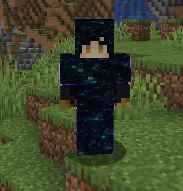
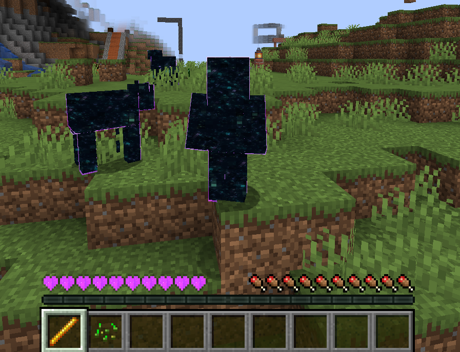

# VOID CORE

Void-themed gameplay framework for Minecraft focused on transformation mechanics, immortal progression systems, and dark energy-based gameplay interactions.

---

## Overview

Void Core introduces a progression-focused gameplay system centered around immortality, void transformations, and enhanced survival mechanics.

The project combines visual transformation systems, custom gameplay mechanics, and immersive progression features to create a dark fantasy-inspired Minecraft experience.

---

## Core Features

- Void transformation mechanics
- Immortal survival systems
- Custom void armor framework
- Enhanced heart & vitality mechanics
- Void-based entity transformations
- Multiplayer-friendly gameplay systems
- Custom visual effects & progression mechanics

---

## Gameplay Systems

The mod is designed around long-term progression and powerful transformation-based gameplay.

Included systems:
- Immortal soul transformation
- Void energy progression
- Custom armor mechanics
- Entity corruption systems
- Enhanced survival attributes
- Dark energy visual effects

---

## Technical Overview

- Modular gameplay architecture
- Custom player state handling
- Client/server gameplay synchronization
- Entity transformation systems
- Custom rendering integration
- Optimized gameplay event processing

---

## Preview

  

  

---

## Status

Active gameplay systems project under continued development.
